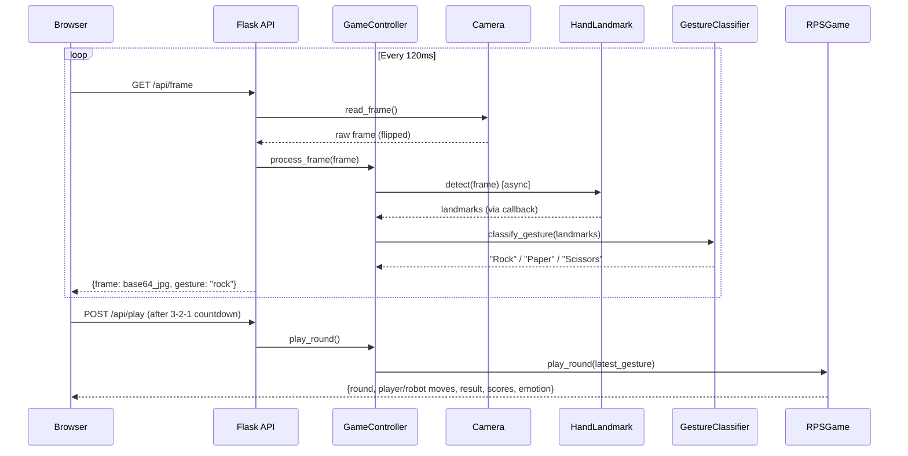

# Fairness-League — Project Walkthrough

## What Is This Project?

**Fairness-League** is a webcam-based **Rock Paper Scissors** game where you play against a robot opponent named **R.O.B.** — a robot with a hidden strategy. The game uses **hand gesture recognition** via your webcam to detect your move in real time. The research question embedded in the title is: *"How fair will you be?"*

---

## Tech Stack

| Layer | Technology |
|-------|-----------|
| **Backend** | Python 3.12 + Flask |
| **Hand Detection** | Google MediaPipe (hand landmark model) |
| **Computer Vision** | OpenCV (`opencv-python`, `opencv-contrib-python`) |
| **Math / Geometry** | NumPy |
| **Frontend** | Single-page HTML/CSS/JS (Jinja2 template) |
| **Audio** | `sounddevice` (dependency present but not actively used in code yet) |

---

## Project Structure

```
Fairness-League/
├── run.py                          # Entry point — creates & runs the Flask app
├── requirements.txt                # Python dependencies
├── .python-version                 # Python 3.12.10
├── app/
│   ├── __init__.py                 # App factory — wires everything together
│   ├── config.py                   # Flask config (DevelopmentConfig)
│   ├── singletons.py              # Global instances (controller, camera)
│   ├── camera.py                   # Webcam capture (OpenCV)
│   ├── hand_landmark.py            # MediaPipe hand detection (async)
│   ├── gesture_classifier.py       # Landmark → Rock/Paper/Scissors logic
│   ├── controller/
│   │   └── controller.py           # Orchestrator: frame → gesture → game
│   ├── game/
│   │   └── rps_game.py             # Game engine: rules, scoring, AI strategies
│   ├── models/
│   │   ├── hand_landmarker.task    # MediaPipe hand landmark model (~7.5 MB)
│   │   └── gesture_recognizer.task # MediaPipe gesture model (~8 MB, unused)
│   ├── blueprints/
│   │   ├── game_api/
│   │   │   └── game_api.py         # REST API: /api/frame, /api/play, /api/reset
│   │   └── video/
│   │       └── video.py            # Legacy MJPEG stream (currently disabled)
│   └── templates/
│       ├── index.html              # Main game UI (767 lines, fully self-contained)
│       └── basic_index.html        # Minimal fallback template
```

---

## How It Works — Data Flow



### Step-by-step:

1. **Webcam polling** — The browser polls `GET /api/frame` every **120ms**. The server reads a frame from the webcam, runs MediaPipe hand detection asynchronously, classifies the gesture, and returns the frame as a base64 JPEG + the detected gesture.

2. **Playing a round** — When the user clicks "Play Round", a **3-2-1 countdown** runs in the browser. At "GO!", it sends `POST /api/play`. The server uses whatever gesture was last detected and pits it against the robot's strategy-based choice.

3. **Game state** — The [RPSGame](file:///Users/sarthakkapaliya/University/Fairness-League/app/game/rps_game.py#32-139) tracks scores, round history, and the robot's emotional state (neutral → happy → ecstatic, or neutral → sad → devastated based on score differential).

---

## The Robot's AI Strategies

> [!IMPORTANT]
> This is the core of the "fairness" research component.

R.O.B. uses a **two-phase strategy system** defined in [rps_game.py](file:///Users/sarthakkapaliya/University/Fairness-League/app/game/rps_game.py):

| Phase | Rounds | Strategy |
|-------|--------|----------|
| **Warmup** | First 4 rounds | [RandomStrategy](file:///Users/sarthakkapaliya/University/Fairness-League/app/game/rps_game.py#12-15) — purely random moves |
| **Main** | Rounds 5–21 | One of three strategies, **randomly chosen at game start** |

### Three possible main strategies:

| Strategy | Behavior |
|----------|----------|
| [RandomStrategy](file:///Users/sarthakkapaliya/University/Fairness-League/app/game/rps_game.py#12-15) | Picks rock, paper, or scissors randomly each round |
| [FixedStrategy](file:///Users/sarthakkapaliya/University/Fairness-League/app/game/rps_game.py#16-22) | Picks **one move** (chosen randomly at game start) and plays it **every round** |
| [CopycatStrategy](file:///Users/sarthakkapaliya/University/Fairness-League/app/game/rps_game.py#23-30) | Copies the **player's previous move** (first move is random) |

The player doesn't know which strategy R.O.B. is using. The implicit question: once the player figures out the pattern, will they exploit it or play "fairly"?

### Other game rules:
- **21 rounds** total (`max_rounds = 21`)
- **Ties don't count** as rounds (the round counter doesn't increment)
- The robot has **5 emotional states** displayed via an SVG face: `neutral`, `happy`, `ecstatic`, `sad`, `devastated` — driven by the score differential

---

## API Endpoints

All endpoints are under the `/api` prefix:

| Endpoint | Method | Purpose |
|----------|--------|---------|
| `/api/frame` | GET | Returns latest webcam frame (base64) + detected gesture |
| `/api/play` | POST | Plays one round using the last detected gesture |
| `/api/reset` | POST | Resets the game to initial state |

---

## Key Components Deep-Dive

### Gesture Classification — [gesture_classifier.py](file:///Users/sarthakkapaliya/University/Fairness-League/app/gesture_classifier.py)

Uses **finger extension detection** by comparing fingertip-to-wrist distance vs. PIP-joint-to-wrist distance:

| Gesture | Index | Middle | Ring | Pinky |
|---------|-------|--------|------|-------|
| ✊ Rock | ✗ | ✗ | ✗ | ✗ |
| ✌️ Scissors | ✓ | ✓ | ✗ | ✗ |
| ✋ Paper | ✓ | ✓ | ✓ | ✓ |

> [!TIP]
> The README notes that scissors should be shown **tilted** (not head-on toward camera) for better recognition accuracy.

### Hand Detection — [hand_landmark.py](file:///Users/sarthakkapaliya/University/Fairness-League/app/hand_landmark.py)

- Uses MediaPipe's `HandLandmarker` in **LIVE_STREAM** mode with async callbacks
- The [hand_landmarker.task](file:///Users/sarthakkapaliya/University/Fairness-League/app/models/hand_landmarker.task) model file (~7.5 MB) is loaded at startup
- Returns 21 hand landmarks (fingertips, joints, wrist) per detected hand

### Frontend — [index.html](file:///Users/sarthakkapaliya/University/Fairness-League/app/templates/index.html)

A fully self-contained single HTML file with inline CSS + JS featuring:
- **SVG robot face** with animated emotional expressions
- **3-column responsive grid**: webcam | robot | results/history
- **3-2-1 countdown** overlay on the webcam feed
- **Game over modal** with final scores and "Play Again"
- Dark theme with gradient effects and micro-animations

---

## How to Run

```bash
# 1. Install Python 3.12
# 2. Install dependencies
pip install -r requirements.txt

# 3. Run the server
python run.py

# 4. Open http://127.0.0.1:5000 in your browser
#    (grant webcam permissions when prompted)
```

> [!CAUTION]
> The app requires a **working webcam** — [VideoCamera](file:///Users/sarthakkapaliya/University/Fairness-League/app/camera.py#6-18) opens device `0` (default camera) on startup. If no camera is available, the app will still start but frames will be `None`.

---

## Known To-Do Items (from README)

- [ ] Add an **info button** that displays game rules (including the "tilt scissors" instruction)
- [ ] **Playtest** the game

## Potential Inconsistency

> [!WARNING]
> The game engine is configured for **21 rounds** (`max_rounds = 21`), but the HTML header says "11 rounds" and the round display shows `/ 11`. These should be synchronized.
